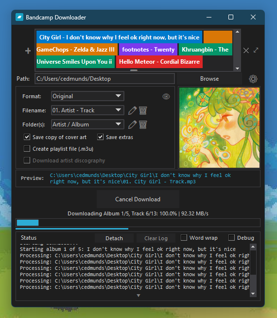

#  Bandcamp Downloader GUI (Python Edition)

A Python-based GUI application for downloading Bandcamp albums with full metadata and cover art support.

## Why This Exists

This was created as an interim solution for users experiencing issues with [Otiel's BandcampDownloader](https://github.com/Otiel/BandcampDownloader). While we wait for official updates and fixes to that excellent C# application, this Python-based alternative provides a working solution.

## What It Does

Bandcamp Downloader (Python Edition) provides a simple way to download the freely available 128 kbps MP3 streams from Bandcamp albums, tracks, and artist pages. It automatically organizes files, embeds metadata, and handles cover art.

*The main download interface with album art preview and settings panel*

## Key Features

* **Executable** - Available in. exe format, simply download and run.
* **Automatic Updates** - Select automatic updates or check now to be notified when there is a new update and accept to install it automatically.
* **Intuitive Interface** - No command-line knowledge required, easy to use.
* **Drag and Drop Support** - Conventiently drag Bandcamp URLs into the app from bandcamp pages or your browers address bar. 
* **Batch Downloads** - Download multiple albums at once by pasting multiple URLs.
* **Discography Support** - Download entire artist discographies with a single click.
* **Organization** - Fully customizable folder structure (e.g. Artist/Album etc.) and filename format (e.g. 01. Artist - Track.mp3).
* **Metadata** - Automatically tags files with artist, album, track number, and date.
* **Cover Art** - Embeds artwork into files and optionally includes a copy in dowloaded files.
* **Format Flexibility** - Download original files provided by Bandcamp (very fast) or re-encode files as: MP3, FLAC, OGG, or WAV (note: converted formats use 128 kbps source and do not improve quality).
* **Playlist Generation** - Create .m3u playlists automatically.
* **Preview Path Link** - previews path and file that will be created, and opens windows explorer to the closest existing folder and directly to the album folder after download.
* **Status Log** - Searchable status log with Ctrl+F, word wrap toggle, and clear with undo.
* **Debug Mode** - Toggle visibility of debug information to troubleshoot issues. 
* **Supported URLs:**
   * Album pages: `https://[artist].bandcamp.com/album/[album]`
   * Track pages: `https://[artist].bandcamp.com/track/[track]`
   * Artist pages: `https://[artist].bandcamp.com` (downloads all available albums)
 

## Quick Start

### Option 1: Launcher (Recommended)

**Installation**

1. Download [BandcampDownloader.exe](https://github.com/kameryn1811/Bandcamp-Downloader/releases/tag/Launcher_v1.3.7) and run it! (everything else is automatic)
2. **Note:** You may see a Windows Defender SmartScreen Warning, see [Troubleshooting](#troubleshooting) for more information. 
3. What it Does:
   - Downloads the latest `bandcamp_dl_gui.py` script from GitHub and Launches it
   - Checks for updates on startup
   - Self-contained - No Python installation needed
   - Comes with ffmpeg.exe bundled
   - Single executable file

### Option 2: Standalone Script (Advanced)

**For users who prefer manual setup:**
  - Smaller download (~200KB script vs ~60MB launcher)
  - Full control over Python and dependencies
  - Easy to modify and test the script if needed

**Prerequisites**

1. **Python 3.11 or higher**
   * Download and Intall: https://www.python.org/downloads/
   * ⚠️ **Must check "Add Python to PATH" during installation**

2. **ffmpeg.exe**
   * Download: https://www.gyan.dev/ffmpeg/builds/
   * Get `ffmpeg-release-essentials.zip`
   * Extract `ffmpeg.exe` from the `bin` folder
   * Place it in the same folder as `bandcamp_dl_gui.py`

**Installation**

1. Download the [Latest Release](https://github.com/kameryn1811/Bandcamp-Downloader/releases/latest) and extract it into a folder e.g. /Bandcamp Downloader
2. Place `ffmpeg.exe` in the folder
3. Double-click `Bandcamp Downloader GUI.bat` (optionally create a shortcut to this file and pin it to your start menu, taskbar, desktop, etc)
4. The app will check for and help install any missing dependencies
5. Profit

## Troubleshooting

**Windows SmartScreen Warning**
- When you open BandcampDownloader.exe for the first time, Windows might say: "Windows protected your PC"
- This happens because the app isn’t code-signed (certificates are pricey, and this is a free open-source project).
- No worries, it’s safe to run. The EXE is the same code you can read on GitHub.
- **To continue:** Click "More info" amd "Run anyway", Windows won't nag you again for the same. exe. 
- **Want extra peace of mind?** - You can review the code, build it yourself, or use the standalone Python script like in Option 2.

**"Python not found"**
- Reinstall Python and ensure "Add Python to PATH" is checked
- Or manually add Python to your system PATH

**Windows 7: Missing DLL or Failed to load Python Errors**
- If the app won’t launch on Windows 7 and you see errors like “api-ms-win-core-path-l1-1-0.dll not found” or “Failed to load Python DLL,” Windows 7 is missing a DLL required by Python 3.11+.
- Fix it with the latest compatibility patch from nalexandru: https://github.com/nalexandru/api-ms-win-core-path-HACK/releases
- Download the latest release and copy the DLLs to the following locations:
  - x86 → C:\Windows\SysWOW64
  - x64 → C:\Windows\System32 (Admin rights may be needed)
- Launch the app!
- Thanks to @alabx for this [fix](https://github.com/kameryn1811/Bandcamp-Downloader/issues/6)! 

**"ffmpeg.exe not found"**
- Download from https://www.gyan.dev/ffmpeg/builds/
- Place `ffmpeg.exe` in the same folder as the script

**"No files downloaded"**
- Album may require purchase
- Some content is only available after buying
- Verify the album streams for free on Bandcamp

**Album art not displaying in Interface**
- Install Pillow: `python -m pip install Pillow`
- The app will prompt to install it automatically
  
**Album art and path previews slow to load or not showing at all**
- VPNs, proxies, or ISP “secure connection” features can block or slow the CDN requests used to fetch artwork. Try turning these off or switching to a faster VPN location.
- Antivirus software with HTTPS/SSL scanning (Kaspersky, ESET, Dr.Web, etc.) may interfere with image requests — temporarily disable these features to test.If it helps, whitelist BandcampDownloader.exe and bandcamp.com.
- Bad DNS routing can also cause slow or missing images. Switching to 1.1.1.1, 8.8.8.8, or 9.9.9.9 may help.

## Audio Quality & Artist Support

**⚠️ About Quality**

This tool downloads the free **128 kbps MP3 streams** that Bandcamp makes available for previewing music. These are the same quality files you hear when streaming on the website.

**Converting to FLAC, OGG, or WAV does NOT improve quality** - it only changes the file format. The source remains 128 kbps.

**🎵 Support the Artists**

For high-quality audio (FLAC, 320 kbps MP3, etc.), **please purchase albums directly from Bandcamp**. 

Bandcamp is one of the best platforms for independent artists:
* Artists receive a larger share of revenue than other platforms
* You get high-quality downloads with your purchase
* You're directly supporting the musicians you love

**If you enjoy the music, please support the artists by purchasing their work!**

## Credits & Inspiration

This project exists thanks to [Otiel's BandcampDownloader](https://github.com/Otiel/BandcampDownloader). This Python version was created to provide a working alternative while we await updates to the original project.

**Thank you, Otiel, for the inspiration and for building such a useful tool!**

## Legal & Ethical Use

This tool is designed for:
* Personal use of music you own or have permission to download
* Accessing freely available stream files
* Building a local library of music you've purchased

Please respect copyright laws and Bandcamp's terms of service. Support artists by purchasing music when possible.

## Disclaimer

This software is provided as-is for educational and personal use. The developers are not responsible for misuse. Please use responsibly and support the artists whose music you enjoy.
